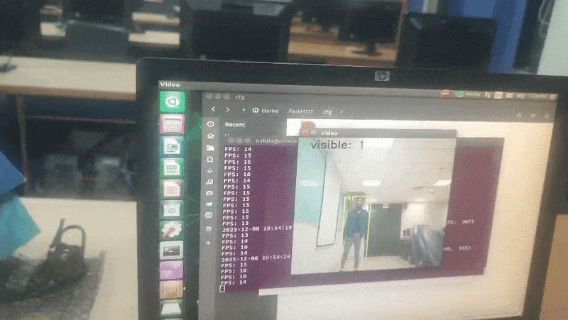

# 🧍‍♂️ Real-Time Human Detection & Tracking

## 🚀 Overview
Human detection and tracking are fundamental problems in computer vision with applications in **surveillance, robotics, autonomous navigation, and crowd analytics**.

This project presents a **comparative evaluation of real-time multi-object human tracking** across two hardware environments:

1. **Laptop (RTX GPU)**  
   → High-accuracy pipeline using **YOLOv8 + BYTETracker**

2. **Jetson Nano (Edge Device)**  
   → Resource-efficient pipeline using **YOLOv4-tiny + FastMOT**

The objective is to analyze the **accuracy–speed trade-off**, evaluate **detector and tracker performance**, and study **deployment feasibility on edge devices**.

---

## 🧠 Pipelines Overview

### 💻 Laptop (RTX GPU)
- **Detector:** YOLOv8 (Ultralytics)
- **Tracker:** BYTETracker
- **Frameworks:** PyTorch, OpenCV
- **Goal:** State-of-the-art accuracy and stable multi-object tracking

### 🟩 Jetson Nano (Edge Device)
- **Detector:** YOLOv4 / YOLOv4-tiny
- **Tracker:** FastMOT (DeepSORT / KLT + ReID)
- **Acceleration:** TensorRT
- **Goal:** Real-time performance under constrained compute

---

## 🧪 Detector Evaluation (YOLOv4-tiny)

YOLOv4-tiny was trained on the **COCO human class subset (4299 images)** and evaluated using standard detection metrics.

### 📊 Detection Metrics

| Metric      | Value  |
|------------|--------|
| **AP (Class)** | 40.10 |
| **Precision** | 0.70  |
| **Recall**    | 0.35  |
| **F1-score**  | 0.46  |
| **mAP**       | 0.4009 |

> **Observation:**  
> The model achieves **high precision** with moderate recall, making it suitable for real-time tracking where false positives must be minimized.

---

### 📈 Detector Comparison (AP@0.5)
The following graph compares **YOLOv4-tiny**, **YOLOv7-tiny**, and **YOLOv7** at AP@0.5:

---

### 🧩 Confusion Matrix (YOLOv4-tiny)
The confusion matrix below illustrates true positives, false positives, and missed detections:

---

## 🧠 Laptop Pipeline: YOLOv8 + BYTETracker
**Components:**
- **YOLOv8:** High-accuracy real-time object detector
- **BYTETracker:** Robust data association with minimal ID switches
- **OpenCV:** Visualization and video processing

### 🎥 State-of-the-Art MOT Demo

**Key Characteristics:**
- High detection accuracy
- Stable identity preservation
- ~30 FPS on RTX GPU

---

## 🟩 Jetson Nano Deployment: FastMOT

Due to hardware constraints, YOLOv8 is not feasible on Jetson Nano. Instead, **FastMOT** is used as a lightweight MOT framework.

🔗 **FastMOT Repository:** https://github.com/GeekAlexis/FastMOT

### 🔧 FastMOT Features
- TensorRT-optimized inference
- Hybrid tracking using **DeepSORT, KLT, and ReID**
- Designed for embedded NVIDIA platforms

---

### 🎥 YOLOv4-tiny Standalone Testing (Colab)

---

### 🎥 FastMOT + YOLOv4-tiny on Jetson Nano

---

## 📊 Multi-Object Tracking Evaluation (Jetson Nano)

### 🔹 Tracking Results on Jetson Nano

| Dataset | MOTA (%) | IDF1 (%) | HOTA (%) | MOTP (%) | MT | ML |
|-------|----------|----------|----------|----------|----|----|
| **MOT17 (Pedestrian)** | 50.60 | 61.74 | 51.23 | 85.13 | 78 | 158 |
| **MOT20 (Pedestrian)** | 55.22 | 48.95 | 41.11 | 84.79 | 443 | 377 |

---

### 🔹 Reference: FastMOT Original Results (MOT20)

| Method | MOTA (%) | IDF1 (%) | HOTA (%) | MOTP (%) | MT | ML |
|------|----------|----------|----------|----------|----|----|
| **FastMOT (Original)** | 66.8 | 56.4 | 45.0 | 79.3 | 912 | 274 |

> **Note:**  
> Performance gap is expected due to **hardware limitations**, **custom-trained detector**, and **real-world deployment conditions**.

---

### 📈 MOT17 & MOT20 Tracking Curves
The following plots show tracking performance trends on MOT17 and MOT20:

---

## ⚖️ Performance Comparison

| Hardware | Detector | Tracker | FPS | Notes |
|--------|----------|---------|-----|------|
| **Laptop (RTX GPU)** | YOLOv8 | BYTETracker | ~30 | State-of-the-art accuracy |
| **Jetson Nano** | YOLOv4 (Pre-trained) | FastMOT | 4–5 | Low accuracy |
| **Jetson Nano** | YOLOv4-tiny (600 imgs) | FastMOT | 12–15 | Improved FPS, unstable |
| **Jetson Nano** | YOLOv4-tiny (COCO – 4299 imgs) | FastMOT | 12–15 | Best balance |

---

## 🏁 Conclusion
- **YOLOv8 + BYTETracker** provides superior accuracy but requires powerful GPUs.
- **YOLOv4-tiny + FastMOT** achieves **real-time tracking on edge devices** with acceptable accuracy.
- Results highlight the **trade-off between performance and deployability**.

This project demonstrates an end-to-end **detector–tracker evaluation pipeline** suitable for both research and real-world edge deployment.

---
