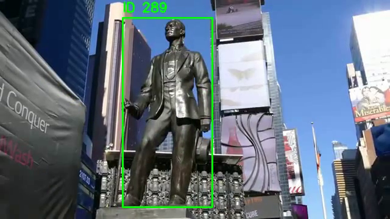

# Real-Time Human Detection and Tracking  
### Using State-of-the-Art Methods on Laptop & FastMOT Deployment on Jetson Nano

Human detection and tracking are essential components in modern computer vision systems, supporting applications such as intelligent surveillance, crowd analytics, and autonomous navigation. This project benchmarks **state-of-the-art human tracking performance on a high-performance laptop**, and then deploys a lightweight, real-time optimized solution (**FastMOT**) on the **NVIDIA Jetson Nano** for edge-level comparison.

---

## 🚀 Project Overview

This repository contains two parts:

### **1. State-of-the-Art Tracking on Laptop (YOLOv8 + ByteTrack)**  
We first implemented a modern tracking pipeline using:

- **YOLOv8** for real-time detection  
- **ByteTrack** for multi-object tracking  
- Tested on an NVIDIA RTX-4060 laptop  
- Achieved smooth, stable tracking in live videos  

This establishes a **performance baseline** on a powerful machine.

### **2. Jetson Nano Deployment — FastMOT (Upcoming)**  
The Jetson Nano cannot run heavy YOLOv8 + ByteTrack models at real-time.  
So, we will implement and benchmark:

🔗 **FastMOT:** https://github.com/GeekAlexis/FastMOT  
- Highly optimized pipeline for Jetson Nano  
- TensorRT-accelerated  
- Designed for edge devices  
- Lower latency, higher FPS under limited compute  

We will compare **Jetson Nano performance** against the **state-of-the-art laptop results** provided in this repo.

---

## 📹 State-of-the-Art Laptop Tracking Demo

Click the image below to watch the tracking output:

*If GitHub does not auto-play the video, it will download or play in a separate tab.*

---

## 🧠 Technologies Used

### **Laptop (Baseline)**
- YOLOv8 (Ultralytics)
- ByteTrack Tracker
- OpenCV
- Python 3.10

### **Jetson Nano Deployment (Planned)**
- FastMOT
- TensorRT 8.x
- CUDA-accelerated OpenCV
- DeepStream-compatible pipeline

---

## 📁 Repository Structure

