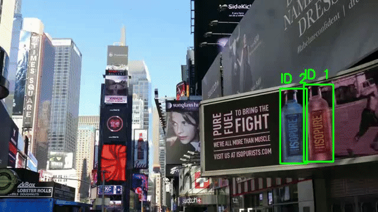

# 🧍‍♂️ Real-Time Human Detection & Tracking

## 🚀 Overview
Human detection and tracking are essential tasks in computer vision, enabling applications like surveillance, robotics, autonomous navigation, and crowd analytics.

This project evaluates **real-time multi-object human tracking** across two environments:

1. **Laptop (RTX GPU):**
   Running **YOLOv8 + BYTETracker** for high accuracy and smooth tracking.

2. **Jetson Nano (Edge Device):**
   Deploying the optimized **FastMOT** pipeline to achieve real-time performance under computational constraints.

The goal is to compare **accuracy, inference speed, and deployment feasibility** between high-end hardware and embedded systems.

---

## 🎯 Progress and Results

### **1. Laptop (RTX GPU) Implementation**
- **Pipeline:** YOLOv8 + BYTETracker
- **Performance:** Achieved **30 FPS** with state-of-the-art accuracy.
- **Outcome:** High-accuracy human detection and stable multi-object tracking.

### **2. Jetson Nano Deployment**
- **Initial Implementation:** FastMOT with pre-trained YOLOv4 (human dataset).
  - **Performance:** 4-5 FPS, but poor accuracy in diverse scenes.
- **First Optimization:** Trained YOLOv4-tiny on a custom dataset (600 images from Roboflow).
  - **Performance:** Improved to **14-15 FPS**, but accuracy remained inconsistent.
- **Final Optimization:** Trained YOLOv4-tiny on the COCO dataset (55,000 images) using **Google Colab**.
  - **Performance:** Achieved **15 FPS** with significantly improved accuracy.

---

## 🧠 Laptop Pipeline (YOLOv8 + BYTETracker)
**Components:**
- **YOLOv8 (Ultralytics):** Real-time deep-learning object detector
- **BYTETracker:** Robust low-ID-switch multi-object tracker
- **OpenCV:** Visualization and video processing

This configuration is close to state-of-the-art and ideal for benchmarking accuracy.

---

## 🎥 State-of-the-Art MOT Results (Laptop)
The following demo shows YOLOv8 + BYTETracker running on a laptop GPU:

This pipeline provides:
- High-accuracy human detection
- Stable multi-object ID tracking
- Real-time performance on standard desktop hardware

---

## 🟩 Jetson Nano Deployment (FastMOT)
Since running YOLOv8 + BYTETracker directly on Jetson Nano is impractical, this project uses **[FastMOT](https://github.com/GeekAlexis/FastMOT)**, a lightweight and optimized tracking framework for edge devices.

### **FastMOT Features:**
- **TensorRT Acceleration:** Optimized for NVIDIA Jetson platforms, enabling faster inference.
- **Lightweight Tracking:** Uses a combination of **DeepSORT**, **KLT (Kanade-Lucas-Tomasi)**, and **ReID (Re-Identification)** for efficient tracking.
- **Modular Design:** Supports multiple detectors (YOLOv4, YOLOv4-tiny, etc.) and tracking algorithms.
- **Real-Time Performance:** Designed to run efficiently on resource-constrained devices like the Jetson Nano.

### **FastMOT Pipeline:**
1. **Detector:** YOLOv4-tiny (optimized for speed and accuracy balance).
2. **Tracker:** DeepSORT or KLT for object association.
3. **Post-Processing:** OpenCV for visualization and output.

🔗 **[FastMOT GitHub Repository](https://github.com/GeekAlexis/FastMOT)**

---

## 🎥 Final Testing Video (YOLOv4-tiny on Jetson Nano)
The following demo shows the final results of YOLOv4-tiny (trained on the COCO dataset) running on Jetson Nano:

---

## 📊 Performance Comparison: Laptop vs. Jetson Nano

| Hardware          | Detector                     | Tracker       | FPS | Notes                          |
|-------------------|------------------------------|---------------|-----|--------------------------------|
| **Laptop (RTX GPU)** | YOLOv8n/s                    | BYTETracker   | 30  | State-of-the-art accuracy      |
| **Jetson Nano**     | YOLOv4 (Pre-trained)         | DeepSORT/KLT  | 4-5 | Low accuracy                   |
| **Jetson Nano**     | YOLOv4-tiny (600 images)      | DeepSORT/KLT  | 12-15 | Improved FPS, inconsistent accuracy |
| **Jetson Nano**     | YOLOv4-tiny (COCO dataset)    | DeepSORT/KLT  | 12-15  | Balanced FPS and accuracy      |

---

This comparison highlights the trade-offs between **accuracy** and **real-time performance** across platforms.
